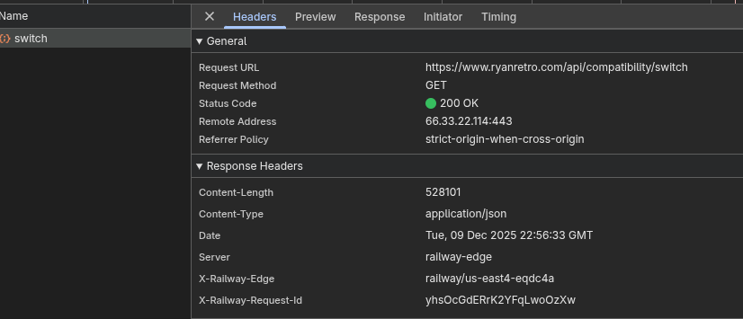
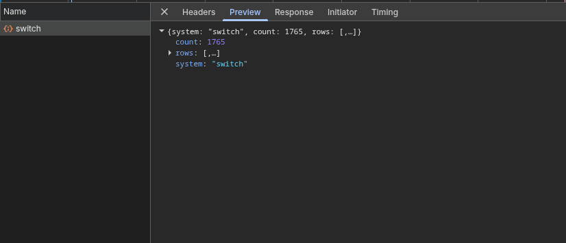
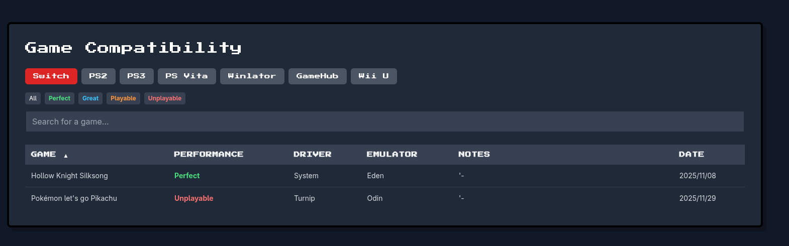
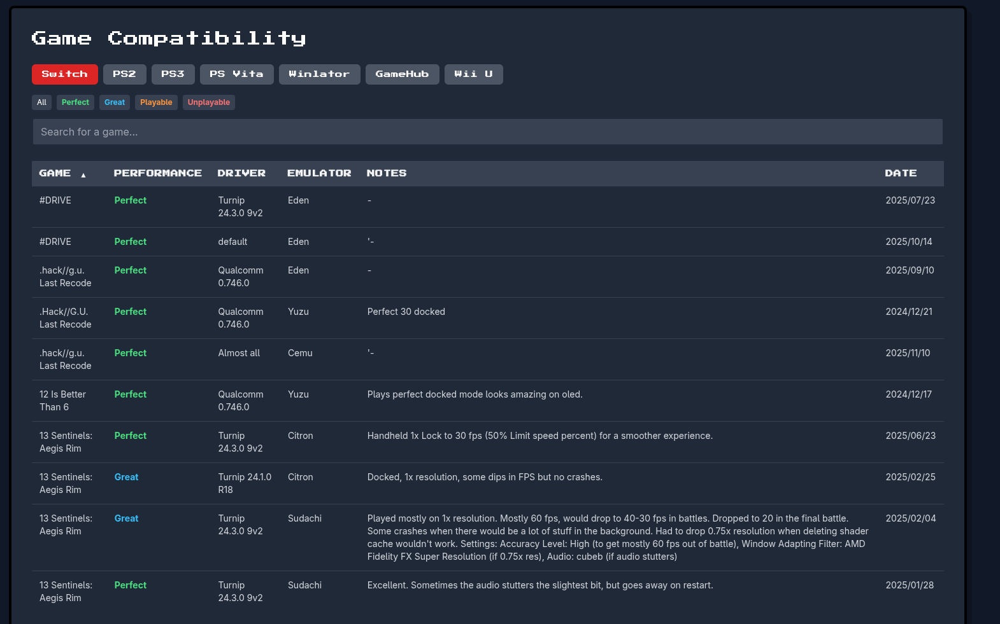

# Ryan Retro Backend

The **Ryan Retro Backend** project aims to optimize and enhance the backend services for the Ryan Retro platform, ensuring better performance, reduced costs, and an improved user experience. This project addresses key issues identified in the current implementation and introduces solutions to make the API more efficient and reliable.

## Identified Issues and Proposed Improvements

### 1. The Data Fetching problem

Currently, the API retrieves all records for a given console emulator whenever a page is loaded, even though only a subset of the data is displayed on the frontend. For example, on the Odin 3 page, the API fetches all compatibility data for the Nintendo Switch, leading to unnecessary data transfer and increased costs.

#### Request




#### What is in the screen



**Proposed Solution:**

- Implement API filtering to ensure only the necessary data is sent to the frontend.
- Introduce query parameters to allow filtering by console, processor, or other relevant criteria.
- Optimize data transfer to reduce bandwidth usage and cloud service costs.

### 2. Duplicate and Conflicting Records

The current system occasionally contains duplicate or conflicting records, which can lead to inconsistencies in the displayed data.



**Proposed Solution:**

- Develop an algorithm to prioritize and display the most recent or most relevant records.
- Implement data validation and deduplication mechanisms to ensure data integrity.
- Enhance the database structure to prevent conflicting entries.

## Benefits of the Improvements

- **Cost Efficiency:** By reducing unnecessary data transfer, the platform will save on cloud service expenses.
- **Improved Performance:** Faster API responses and reduced data payloads will enhance the user experience, especially for users with limited internet connectivity.
- **Data Accuracy:** Eliminating duplicate and conflicting records will ensure that users receive reliable and consistent information.
- **Scalability:** The optimized backend will be better equipped to handle future growth and additional features.

## Project Goals

- Deliver a robust and scalable backend solution for the Ryan Retro platform.
- Ensure the API is tailored to the specific needs of the frontend, minimizing resource usage.
- Provide a seamless and reliable experience for users worldwide, including those in regions with variable internet connectivity.

## Getting Started

To get started with the project, follow these steps:

1. Clone the repository:

    ```bash
    git clone https://github.com/marciosindeaux/ryan-retro-backend.git
    cd ryan-retro-backend
    ```

2. Install dependencies:

    ```bash
    npm install
    ```

3. Start the development server:

    ```bash
    npm run start:dev
    ```

4. Run tests:
    ```bash
    npm run test
    ```

## Contributing

Contributions are welcome! If you have ideas or suggestions for improving the backend, feel free to open an issue or submit a pull request.

## License

This project is licensed under the [MIT License](LICENSE).

---

By addressing the identified issues, the Ryan Retro Backend will become a more efficient and reliable service, ensuring a better experience for all users.
